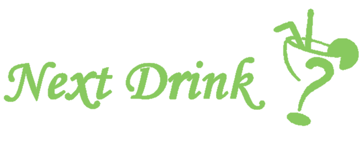

# Getting Started with Create React App
## Available Scripts
### `npm start`
Runs the app in the development mode.\
Open [http://localhost:3000](http://localhost:3000) to view it in your browser.

- first view

- description(text)

- main function - to choose drink
- if you don't decide which cocktail you want to drink, try the random button.
- if you order a cocktail, type its name to see the detail of this cocktail. - includes description and ingredients.

- favourite - to save your favourite one or record what you drink.
- firebase for log in and sign up

- main page description
- hooks you use.
- how it works.

- murmur

